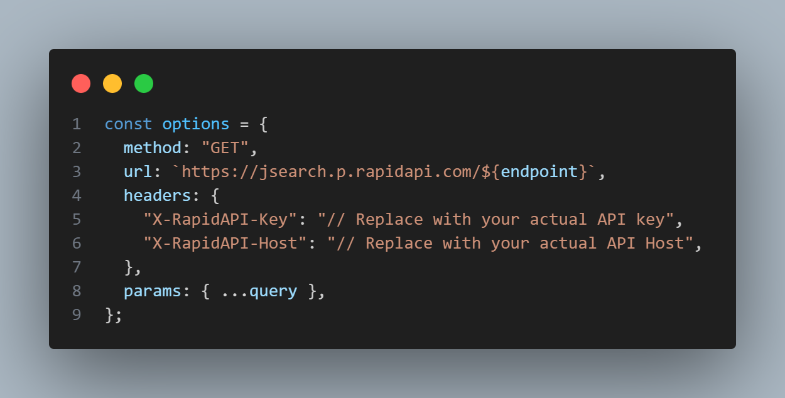
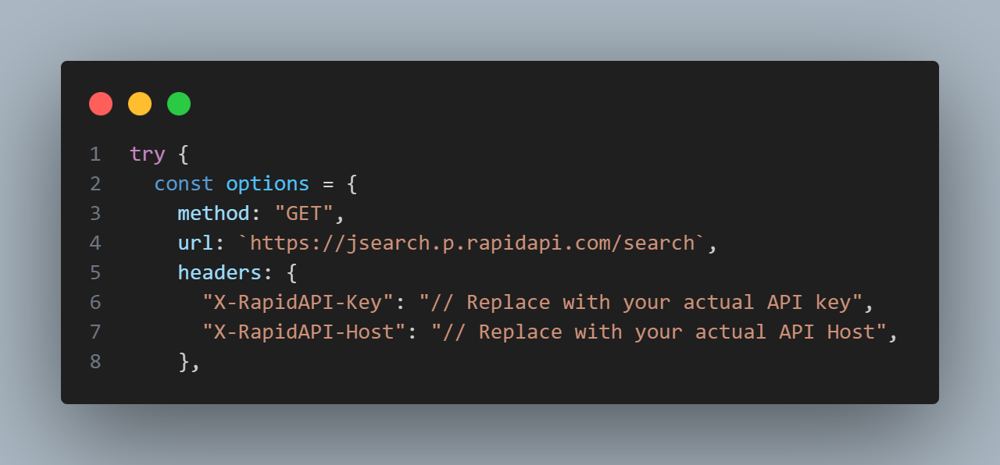

# React Native Expo Job Search App 🚀

Welcome to my React Native Expo application designed to simplify job searches through seamless API integration. This application offers a wide range of features, allowing users to effortlessly discover specific job details by fetching data from relevant APIs.

# Media Folder

Explore the application's design through screenshots and a demonstration video available in the "media" folder. Additionally, an APK file is provided for hands-on testing.

## Known Issues and Pending Components

- **Profile Picture Component:** The profile picture component in the top right corner is currently under development.
- **Menu Button:** The menu button in the top left corner is pending implementation.
- **Show All Button:** The functionality for the "show all" button is yet to be implemented.
- **Share Button:** The functionality for the "share" button is yet to be implemented.

### Note for Android Users

The application's visuals may not render as intended on Android devices. To address this, certain elements are commented out in the file `\react_native_jobs\constants\theme.js`. Please review and modify as needed for optimal performance on Android.

## Testing Instructions

### Registration/Login

To test the application:

1. Register or log in at [Rapid API](https://rapidapi.com/hub).
2. Subscribe to [JSearch By OpenWeb Ninja](https://rapidapi.com/letscrape-6bRBa3QguO5/api/jsearch/) to obtain the "X-RapidAPI-Key."

### Key Integration

Insert the obtained "X-RapidAPI-Key" values in the following files:

- `\react_native_jobs\hook\useFetch.js`

  

- `\react_native_jobs\app\search\[id].js`

  

## Acknowledgments

Huge thanks to [JavaScript Mastery](https://youtube.com/@javascriptmastery?si=StSRM-GSsE24CjKb) for their React Native Course Tutorial for Beginners. This tutorial has played a crucial role in expanding our knowledge and skills, consolidating numerous concepts in a single, informative video.

## Enjoy Exploring!

Feel free to explore and test the application. Your feedback is highly appreciated.
